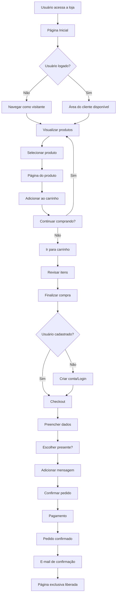

# 🛒 Loja - E-commerce WordPress

Um projeto de e-commerce desenvolvido com WordPress e WooCommerce para a disciplina de Programação Web.

## 👥 Equipe de Desenvolvimento

- **Luiz Augusto Oliveira**
- **Iris Almeida** 
- **Leticia Farias**

## 📋 Sobre o Projeto

Este projeto consiste no desenvolvimento de uma loja virtual completa utilizando WordPress como CMS e WooCommerce como plataforma de e-commerce. O tema foi desenvolvido do zero com funcionalidades customizadas para proporcionar uma experiência de compra otimizada.

## 🚀 Funcionalidades Principais

### 🎨 Interface e Design
- **Design Responsivo**: Layout adaptável para diferentes dispositivos
- **Tema Customizado**: Desenvolvido especificamente para o projeto
- **Slider de Produtos**: Carrossel na página inicial com produtos em destaque
- **Sistema de Busca**: Funcionalidade de pesquisa integrada no cabeçalho

### 🛍️ Funcionalidades de E-commerce
- **Catálogo de Produtos**: Exibição organizada dos produtos
- **Carrinho de Compras**: Sistema completo de carrinho com contador
- **Checkout Personalizado**: Processo de finalização customizado
- **Área do Cliente**: Dashboard personalizado para usuários
- **Página Exclusiva**: Conteúdo restrito para clientes que compraram produtos específicos

### 📧 Sistema de E-mails
- **E-mails Personalizados**: Templates customizados para notificações
- **Rodapé Personalizado**: Links para redes sociais nos e-mails
- **Metadados do Pedido**: Informações adicionais nos e-mails de confirmação

### 🎁 Funcionalidades Especiais
- **Opção de Presente**: Campo para embrulhar produtos como presente
- **Mensagens Personalizadas**: Campo para adicionar mensagens aos pedidos
- **Produtos em Destaque**: Seções para lançamentos e mais vendidos

## 🏗️ Estrutura do Projeto

```
loja/
├── css/                    # Arquivos de estilo
│   ├── base.css           # Estilos base
│   ├── header.css         # Estilos do cabeçalho
│   ├── footer.css         # Estilos do rodapé
│   ├── home.css           # Estilos da página inicial
│   ├── product.css        # Estilos de produto
│   ├── products.css       # Estilos da listagem
│   ├── slide.css          # Estilos do slider
│   └── woocommerce.css    # Estilos do WooCommerce
├── js/                    # Scripts JavaScript
│   ├── script.js          # Scripts principais
│   └── slide.js           # Scripts do slider
├── img/                   # Imagens e ícones
│   ├── icons/             # Ícones do projeto
│   ├── loja.svg           # Logo principal
│   └── loja-white.svg     # Logo em branco
├── inc/                   # Arquivos de inclusão
│   ├── checkout-customizado.php    # Customizações do checkout
│   ├── product-list.php            # Funções de listagem
│   └── user-custom-menu.php        # Menu customizado do usuário
├── woocommerce/           # Templates do WooCommerce
│   ├── archive-product.php         # Página de arquivo de produtos
│   ├── single-product.php          # Página de produto individual
│   └── emails/                     # Templates de e-mail
├── functions.php          # Funções principais do tema
├── header.php            # Cabeçalho do site
├── footer.php            # Rodapé do site
├── index.php             # Página inicial padrão
├── page-home.php         # Template da página inicial
├── page-exclusiva.php    # Template da página exclusiva
└── style.css             # Arquivo de estilo principal
```

## 🔧 Tecnologias Utilizadas

### Stack Principal
- **WordPress** - Sistema de gerenciamento de conteúdo
- **WooCommerce** - Plugin de e-commerce
- **PHP 7.4.30** - Linguagem de programação backend
- **HTML5** - Estruturação das páginas
- **CSS3** - Estilização e layout responsivo
- **JavaScript** - Interatividade frontend
- **MySQL** - Banco de dados (via WordPress)

### Ambiente de Desenvolvimento
- **Local by Flywheel** - Ambiente de desenvolvimento local
- **Apache/Nginx** - Servidor web (configurado pelo Local)
- **phpMyAdmin** - Gerenciamento de banco de dados
- **Git** - Controle de versão

## 📦 Instalação e Configuração

### 🛠️ Ambiente de Desenvolvimento
Este projeto foi desenvolvido utilizando:
- **Local by Flywheel** - Ambiente de desenvolvimento WordPress local
- **PHP 7.4.30** - Versão específica utilizada no desenvolvimento
- **WordPress** - Instalado via Local by Flywheel
- **MySQL** - Banco de dados gerenciado pelo Local

### Pré-requisitos
- Local by Flywheel instalado
- PHP 7.4.30 (configurado automaticamente pelo Local)
- MySQL (incluído no Local by Flywheel)
- WordPress 5.0 ou superior
- Plugin WooCommerce

### Passos para Instalação

#### Opção 1: Usando Local by Flywheel (Recomendado)

1. **Instale o Local by Flywheel**
   - Baixe em: https://localwp.com/
   - Instale e configure o ambiente

2. **Crie um novo site**
   - Abra o Local by Flywheel
   - Clique em "Create a new site"
   - Configure com PHP 7.4.30

3. **Clone o repositório**
   ```bash
   git clone [url-do-repositorio]
   ```

4. **Copie os arquivos do tema**
   - Navegue até a pasta do site no Local
   - Copie a pasta `loja` para `app/public/wp-content/themes/`

5. **Instale o WooCommerce**
   - Acesse o painel administrativo do WordPress
   - Vá em Plugins > Adicionar Novo > WooCommerce
   - Instale e ative o plugin

6. **Ative o tema**
   - Vá em Aparência > Temas
   - Ative o tema "Loja"

7. **Configure o WooCommerce**
   - Execute o assistente de configuração do WooCommerce
   - Configure métodos de pagamento e entrega

#### Opção 2: Instalação Manual

1. **Configure o servidor**
   - Servidor web (Apache/Nginx)
   - PHP 7.4.30
   - MySQL 5.6 ou superior

2. **Instale o WordPress**
   - Baixe e configure o WordPress
   - Configure o banco de dados

3. **Clone e configure o tema**
   ```bash
   git clone [url-do-repositorio]
   cd loja
   ```

4. **Copie o tema**
   - Copie a pasta `loja` para `wp-content/themes/`
   - Ative o tema no painel administrativo

5. **Instale dependências**
   - Instale e configure o WooCommerce
   - Configure métodos de pagamento e entrega

## 🎯 Fluxo Principal da Aplicação



## 🎨 Principais Customizações

### Tema WordPress
- **Suporte ao WooCommerce**: Integração completa com o plugin
- **Imagens Customizadas**: Tamanhos específicos para diferentes seções
- **Limitação de produtos**: 6 produtos por página na loja
- **Remoção de classes**: Limpeza de classes desnecessárias do WooCommerce

### Checkout Personalizado
- **Campo de presente**: Opção para embrulhar como presente
- **Mensagens personalizadas**: Campo para adicionar mensagens especiais
- **Remoção de campos**: Simplificação do processo de checkout

### Sistema de E-mails
- **Rodapé customizado**: Links para redes sociais
- **Metadados do pedido**: Exibição de informações adicionais
- **Templates personalizados**: Design próprio para notificações

## 📱 Responsividade

O projeto foi desenvolvido com foco em responsividade, garantindo uma experiência consistente em:
- **Desktop** (1200px+)
- **Tablet** (768px - 1199px)
- **Mobile** (até 767px)

## 🔒 Segurança

- **Validação de dados**: Sanitização de entradas do usuário
- **Proteção de páginas**: Controle de acesso a conteúdo exclusivo
- **Hooks do WordPress**: Utilização das melhores práticas do WordPress

## 📈 Performance

- **Otimização de imagens**: Tamanhos específicos para cada contexto
- **CSS modular**: Separação de estilos por funcionalidade
- **JavaScript otimizado**: Scripts carregados apenas quando necessário

## 🤝 Contribuição

Este projeto foi desenvolvido como trabalho acadêmico para a disciplina de Programação Web. Contribuições são bem-vindas através de:

1. Fork do projeto
2. Criação de uma branch para sua feature
3. Commit das mudanças
4. Push para a branch
5. Abertura de um Pull Request

## 📄 Licença

Este projeto está sob a licença MIT. Veja o arquivo [LICENSE](LICENSE) para mais detalhes.

## 📞 Contato

Para dúvidas ou sugestões sobre o projeto, entre em contato com a equipe de desenvolvimento.

---